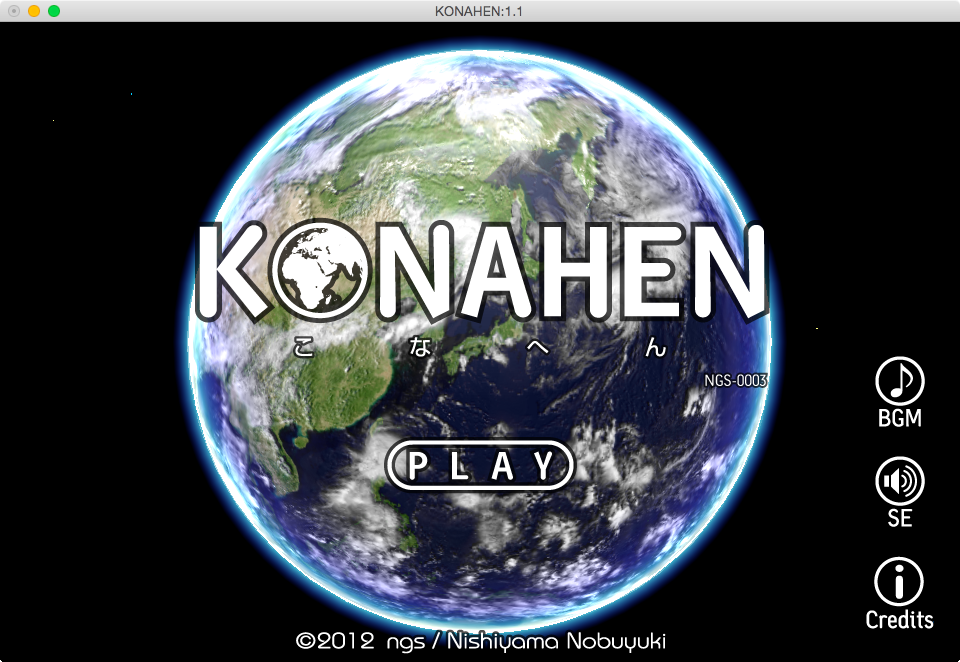
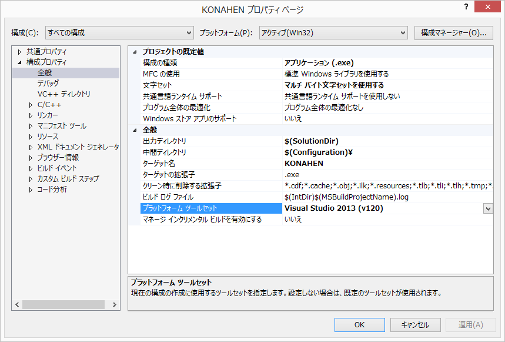

# KONAHEN

## 概要
2012年に発表した自主製作ゲーム。 私が「C++で作った」最後のゲーム。

## 動作環境
+ OSX

  Xcode5以降

+ Windows

  VisualStudio2010以降

  注)ソリューションを開いたのち、プロジェクト設定内、「プラットフォーム ツールセット」を適時変更してください。

  

## あらすじ
『こなへん』とは。

日本の方言で、「だいたいこのあたりです」を言い表す

名古屋弁である…

## あそびかた
- こなへん！

	マウス左クリック

- 地球の回転

	マウス左ドラッグ

- 地球の拡大縮小

	マウス右ドラッグ

- アプリ終了

	Ctrl-q か Ctrl-w

- ウインドウサイズ初期化

	Ctrl-r

## 利用した外部ライブラリ
+ OpenGL 1.1
+ GLUT
+ OpenAL
+ libpng 1.5.12
+ FTGL 2.1.3 RC5
+ freetype 2.4.10
+ libjpeg 8d
+ zlib

## License
License All source code files are licensed under the MPLv2.0 license
[MPLv2.0](https://www.mozilla.org/MPL/2.0/)
